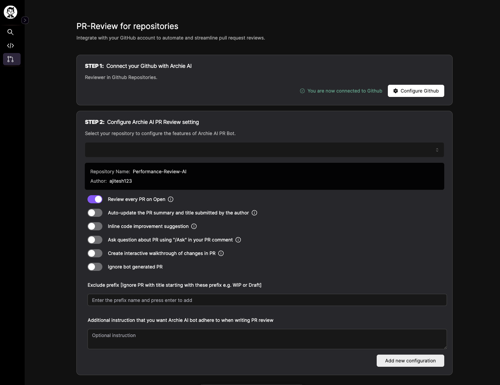

## Archie AI PR Review Feature Documentation

### Overview
Archie AI provides an intelligent PR Review feature that integrates seamlessly with GitHub and GitLab repositories. This feature helps streamline the code review process by offering automated reviews, code suggestions, and interactive walkthroughs.

### Key Features
- **Automated PR Review:** Generate comprehensive reviews for pull requests.
- **Code Suggestions:** Receive code improvement suggestions.
- **Interactive Walkthrough:** Get a step-by-step walkthrough of the changes in a pull request.
- **Customizable Commands:** Use various commands to interact with Archie AI.

### Available Commands
You can interact with Archie AI using the following commands. You can use either the `@archieai` prefix or the shorter `/` prefix for each command.

- `@archieai help` (or `/help`): Show the help message.
- `@archieai ask [question]` (or `/ask [question]`): Ask a question about the PR.
- `@archieai describe` (or `/describe`): Generate a description of the PR.
- `@archieai walkthrough` (or `/walkthrough`): Generate an interactive walkthrough of the PR changes.
- `@archieai complete-review` (or `/complete-review`): Generate a complete review of the pull request.
- `@archieai incremental_review` (or `/incremental-review`): Generate an incremental review of new changes since the last review.

### Example Usage
-  To generate a complete review of a pull request, comment the following on the PR:
`@archieai complete-review` Or `/complete-review`

- To ask a question about a specific part of the PR, comment:
`@archieai ask What is the purpose of this function?`or `/ask What is the purpose of this function?`

### Setup
Follow these steps to set up Archie AI for your GitHub repositories:

1. **Install Archie AI Application in your GitHub Repo:** 

2. **Setup Configuration:**
   - Configure the settings for each repository where you want to use Archie AI.

Archie AI allows you to customize the review settings based on your preferences. Here are the available configuration settings:

- **Review every PR on Open:** Enable or disable automated PR reviews. Default is `False`.
- **Auto-update the PR summary and title:** Automatically update the PR summary and title based on the review. Default is `False`.
- **Inline code improvement suggestion:** Enable or disable code improvement suggestions. Default is `False`.
- **Ask question about PR:** Allow users to ask questions about the PR. Default is `False`.
- **Create interactive walkthrough of changes in PR:** Enable or disable interactive walkthroughs of the PR changes. Default is `False`.
- **Ignore bot generated PR:** Ignore pull requests created by bots. Default is `False`.
- **Exclude prefix:** A list of PR title prefixes to ignore. Default is an empty list `[]`.
- **Additional instruction:** Any special instructions or configurations for the PR review. Default is `None`.

Visit the Archie AI website to update your configuration settings.
